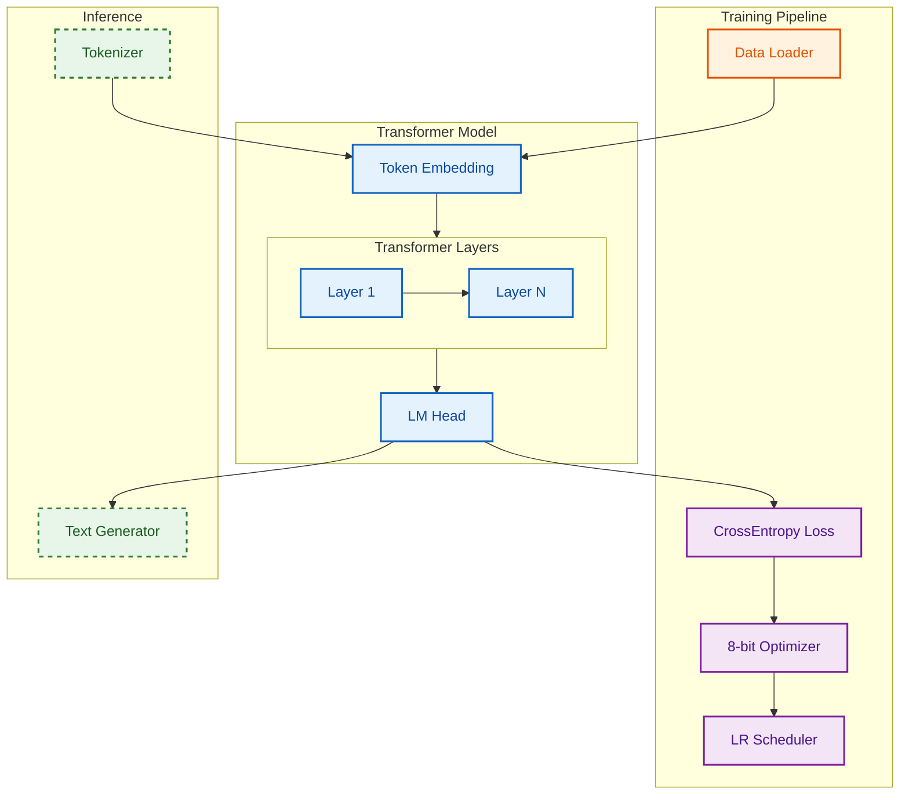

# WafiGPT

基于 PyTorch 实现的轻量级大语言模型（LLM）项目，采用 Transformer 架构，支持自定义训练与对话推理！

## 需要这些依赖

Python 3.11+ 是推荐版本。其他 Python 版本可能需要不同的 pip 命令。

```
pip install torch
pip install safetensors
pip install tokenizers
pip install transformers
pip install accelerate
pip install datasets
pip install tqdm
```

非必需依赖安装，仅用于特定功能。

```
pip install bitsandbytes
pip install peft
pip install evaluate
```

## 文件信息

以下列出所有相关代码及其他相关文档的存储位置。

```
WafiGPT/
├── train.py            # 模型训练脚本
├── chat.py             # 对话推理脚本
├── data/               # 训练数据目录
│   └── ...             # pretrain.txt, finetune.jsonl
│
├── model/              # 模型检查点存储目录
│   └── ...             # model.safetensors, config.json, tokenizer.json
│
└── ...                 # .gitignore, LICENSE
```

## 可爱的架构图

WafiGPT 大语言模型项目通用架构图。



## 模型架构

### 模型架构的参数

| 参数 | 默认值 | 说明 |
|------|--------|------|
| `hidden_size` | 1024 | 隐藏层维度 |
| `ffn_hidden_size` | 4096 | 前馈网络中间层维度 |
| `block_count` | 24 | Transformer 层数 |
| `num_heads` | 16 | 注意力头数量 |
| `num_kv_heads` | 1 | 键值头数量（GQA） |
| `rope_dim` | 64 | 旋转位置编码维度 |
| `vocab_size` | 32000 | 词表大小 |
| `max_seq_length` | 512 | 最大序列长度 |

### 特别的Token们

| Token | ID | 用途 |
|-------|-----|------|
| `<\|padding\|>` | 0 | 填充标记 |
| `<\|unknown\|>` | 1 | 未知词标记 |
| `<\|system\|>` | 2 | 系统提示 |
| `<\|user\|>` | 3 | 输入标记 |
| `<\|assistant\|>` | 5 | 输出标记 |
| `<\|think\|>` | 4 | 思考过程开始 |
| `<\|/think\|>` | 11 | 思考过程结束 |
| `<\|end\|>` | 7 | 序列结束标记 |

## 配置要求

请确保你的计算机满足以下系统要求。

| 配置 | 权限 | 系统版本 | 处理器 | 内存 | 存储 |
|------|------|----------|--------|------|------|
| 最低 | 普通用户 | >= Windows 10 / Linux | 2 GHz | 8GB | 20GB |
| 推荐 | 普通用户 | >= Windows 10 / Linux | 4 GHz | 16GB | 50GB |

## 使用指南

### 训练模型

1. 准备训练数据，放置于 `./data/` 目录
2. 运行训练脚本：

```bash
python train.py
```

训练过程中会自动保存模型检查点至 `./model/` 目录。

### 对话推理

```bash
python chat.py
```

启动后输入提示词即可与模型交互。

### 推理参数

在 `generate_response` 函数中可调整以下参数：

| 参数 | 默认值 | 说明 |
|------|--------|------|
| `max_length` | 512 | 最大生成长度 |
| `temperature` | 0.3 | 采样温度，控制随机性 |
| `repetition_penalty` | 1.0 | 重复惩罚系数 |
| `presence_penalty` | -1.5 | 存在惩罚系数 |

## 项目许可证

本项目采用 MIT 许可证开源。

如有任何问题、需求或 Bug 反馈，请通过以下方式联系我们。

Source Issues : https://github.com/Miwafi/WafiGPT/issues
Official Email : 1942392307@qq.com